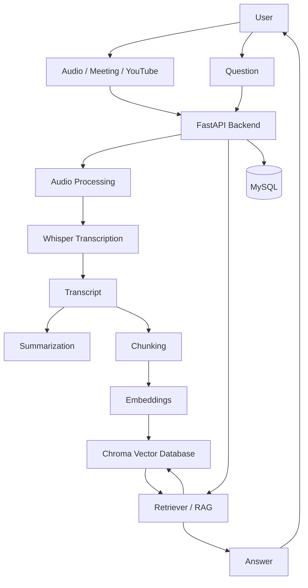

Whisp 🎙️
Whisp is an AI-powered meeting and audio assistant that turns spoken content into text and makes the content easier to understand and search.
The main idea is simple:
Give Whisp an audio/meeting recording or a YouTube source → Whisp transcribes it → processes the transcript → stores the information → lets you ask questions about it.
⚠️ Current Status
Disclaimer: The frontend is currently in progress and is not the final user interface yet. The backend is the working part of the project and can currently be tested using FastAPI Swagger UI.
Start the backend and open http://localhost:8000/docs to test the available API endpoints.

This project is being built step by step, so some parts may change as development continues.
What Whisp Does
Whisp is built around a simple workflow:
1. Take an audio or meeting recording, or get audio from YouTube.
2. Convert/process the audio when needed.
3. Use Whisper for speech-to-text transcription.
4. Create a clean transcript and summary.
5. Split the transcript into smaller pieces for search.
6. Create embeddings and store them in Chroma.
7. Use RAG (Retrieval-Augmented Generation) to find the relevant parts of the transcript.
8. Ask questions about the uploaded meeting or audio and get an answer based on the stored content.
Architecture

In simple words
The FastAPI backend is the main controller of the system.
For an audio/meeting file, the backend first handles the audio and sends it to Whisper. Whisper converts speech into text. The transcript can then be summarized and split into smaller chunks.
Those chunks are converted into embeddings and stored in Chroma, which is used to find the most relevant parts when the user asks a question.
When a question is asked, Whisp retrieves the useful transcript sections and uses them as context to produce the answer. This is the RAG part of the system.
MySQL is used for application-level data storage, while Chroma is used for vector-based retrieval.
Main Flow
1. Upload / Input
Whisp can work with meeting/audio content and YouTube-based input.
2. Audio Processing
When necessary, the input is converted into a format that can be processed by the transcription pipeline.
3. Transcription
Whisper converts the spoken audio into text.
4. Processing
The transcript can be summarized and divided into smaller chunks.
5. Vector Storage
The chunks are converted into embeddings and stored in Chroma.
6. Question Answering
The user asks a question. Whisp searches the stored transcript chunks, retrieves the most relevant information, and uses that context to answer the question.
Backend API
The backend is built with FastAPI.
You can use FastAPI's built-in Swagger UI to test the API without the frontend.
http://localhost:8000/docs
Current API flow
Upload / YouTube
       ↓
Audio Processing
       ↓
Whisper
       ↓
Transcript
       ↓
Summary + Chunks
       ↓
Embeddings
       ↓
Chroma
       ↓
RAG Retrieval
       ↓
Answer
The current backend includes endpoints for health checking, file uploads, YouTube/audio processing, meeting processing, and question answering.
Tech Stack
Part	Technology
Backend	FastAPI
Language	Python
Speech-to-Text	OpenAI Whisper
RAG	LangChain-based pipeline
Vector Database	Chroma
Database	MySQL
Audio Processing	FFmpeg
Video/Audio Download	yt-dlp
Frontend	In progress

Project Structure
Whisp/
├── backend/            # FastAPI backend and AI processing
├── frontend/           # Frontend currently in development
├── docker-compose.yml  # Container setup
├── .gitignore
└── README.md
The backend contains the main application logic for transcription, processing, storage, retrieval, and question answering.
Running the Backend
Go to the backend folder:
cd backend
Create a virtual environment:
python -m venv .venv
Activate it on Linux/macOS:
source .venv/bin/activate
Install the dependencies:
pip install -r requirements.txt
Run the FastAPI server:
uvicorn main:app --reload
Then open:
http://localhost:8000/docs
You can test the backend directly from Swagger UI.
Depending on the current project configuration, environment variables and external services may also need to be configured before all endpoints can be used.

RAG in Whisp
Whisp uses RAG so that questions are answered using the content of the uploaded meeting or audio rather than relying only on a general-purpose model.
The basic idea is:
Transcript
   ↓
Split into chunks
   ↓
Create embeddings
   ↓
Store in Chroma
   ↓
User asks a question
   ↓
Find relevant chunks
   ↓
Use retrieved context
   ↓
Generate answer
This makes it possible to ask things like:
- What was discussed in the meeting?
- What decisions were made?
- What tasks were assigned?
- What was said about a particular topic?
Why Whisp?
Meetings and long audio files contain a lot of useful information, but going through them manually can take time.
Whisp tries to make that easier by combining:
Speech-to-text + Summarization + Vector Search + RAG
in one system.
Future Work
The project is still under development. Planned work includes improving the frontend and connecting it properly with the backend API.
Other improvements can include better meeting organization, cleaner transcript handling, better retrieval, and a more complete user experience.
Note
Whisp is an ongoing personal project and its architecture may change as new features are added and the system is improved.
